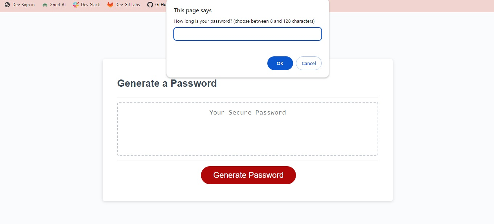
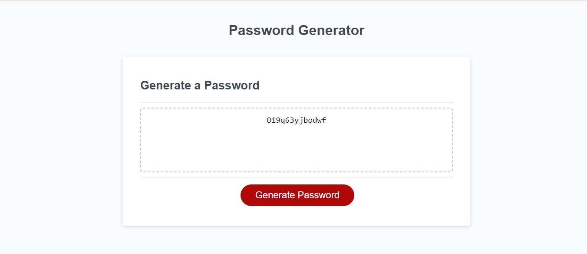

### <Password Generator>

## Description

This program was developed to create a random password using a combination of upper-case, lower-case, number and special characters.

## Installation

No installation necessary!

## Usage

    To use the application:
    -begin with entering youre desired amount of chracters for password.
    -complete additional questions to specify the parameters of password.

# Link to website!
https://kalleepar.github.io/password-generator/

## Credits

- Kal Parker
- Special Thanks to MDN and W3schools

## License

MIT LICENSE